# Process Files on Oracle Cloud Object Storage with a scalable Cloud Native Flow

## Introduction

Often, in our applications, we need to process large quantities of files. In the past, this was done in batch form, but with new technologies and the advent of the cloud, we are now able to transform many serial processes into parallel ones. The use of message queues, Kubernetes clusters and event-driven architectures are some of the technologies and architectures widely used to get the best out of large volume processing.

**Oracle Cloud Infrastructure** has resources to allow scalability and cost reduction. Let's explore the Cloud Native universe:

- **Oracle Cloud Infrastructure (OCI) Object Storage** enables customers to securely store any type of data in its native format. With built-in redundancy, Object Storage in OCI is ideal for building modern applications that require scale and flexibility, as they can be used to consolidate multiple data sources for analysis, backup, or archival purposes.

- **Oracle Cloud Infrastructure (OCI) Streaming** service is an Apache Kafka-compatible, serverless, real-time event streaming platform for developers and data scientists. Streaming is fully integrated with OCI, Database, GoldenGate and Integration Cloud. The service also offers out-of-the-box integrations for hundreds of third-party products in categories such as DevOps, databases, big data, and SaaS applications.

- **Oracle Cloud Infrastructure (OCI) Events Service** tracks changes made to resources using events that comply with the Cloud Native Computing Foundation (CNCF) CloudEvents standard. Developers can respond to changes made in real time by triggering code with Functions, recording to Streaming, or sending alerts using Notifications.

- **Oracle Cloud Infrastructure (OCI) Functions** is a serverless computing service that allows developers to build, run, and scale applications without managing any infrastructure. Functions has native integrations with other Oracle Cloud Infrastructure services and SaaS applications. Because Functions is based on the open source Fn Project, developers can create applications that can be easily ported to other cloud and on-premises environments. Functions-based code typically runs for short periods of time, is stateless, and executes for a single logic purpose. Customers only pay for the resources they use.

- **Oracle Cloud Infrastructure Container Engine for Kubernetes (OKE)** is a managed **Kubernetes** service that simplifies large-scale, enterprise-grade Kubernetes operations. It reduces the time, cost, and effort required to manage complex Kubernetes infrastructure. Container Engine for Kubernetes lets you deploy Kubernetes clusters to ensure reliable operations on the control plane and worker nodes with automatic scaling, updates, and security patches. Additionally, OKE offers a fully serverless Kubernetes experience with virtual nodes.

In this material, you can see a very common way of processing large amounts of files, where applications can deposit their files in a bucket in **OCI Object Storage** and when these files are deposited, an event is generated allowing a function can be triggered to write the **URL** of this file to **Streaming**.

>**Note:** We could imagine this solution just with some source application saving the content of this files in **Streaming** while our application just reads this content, but it is not a good practice to transfer large volumes of data within a Kakfa queue. To do this, our approach will use a pattern called **Claim-Check**, which will do exactly as our proposal, instead of sending the file through the message queue, we will send the reference to this file. We will delegate reading the file to the application that will be in charge of processing it.

Our solution would then feature these components:

- OCI Object Storage
- OCI Events
- OCI Functions
- OCI Streaming

At the end of this chain, we would have the application consuming the **Streaming** queue, however, we will not discuss how the file will be processed.

## Objectives

The objective of this material will be to show how to implement a scalable event architecture that will allow processing large amounts of files through the use of Object Storage, Events, Functions and Streaming.

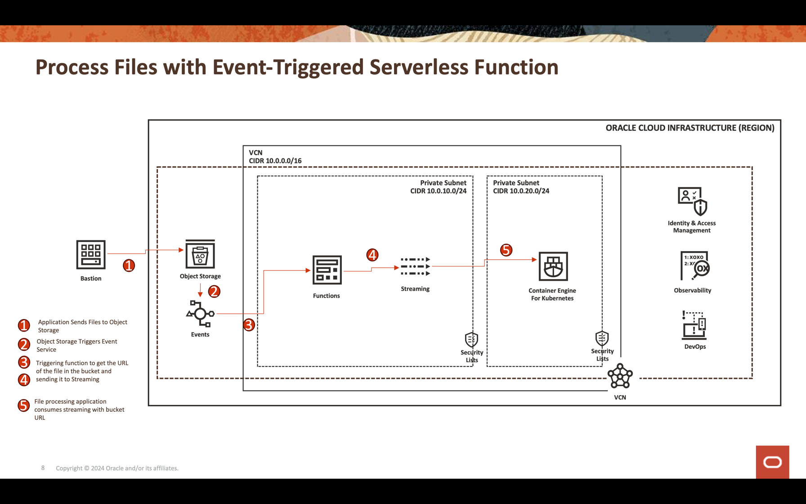

## Pre-Requisites

## Task 1 - Create the OCI Streaming Instance

Oracle Cloud Streaming is a Kafka like managed streaming service. You can develop applications using the Kafka APIs and common SDKs in the market.
So, in this demo, you will create an instance of Streaming and configure it to execute in both applications to publish and consume a high volume of data.

First, you need to create an instance. Select the Oracle Cloud main menu e find the **Analytics & AI** option. So go to the **Streams**.

Change the compartment to **analytics**. Every resource in this demo will be created on this compartment. This is more secure and easy to control IAM.

So, click on **Create Stream** button:

Fill the name with **kafka_like** (for example) and you could maintain all other parameters with the default values:

So click the **Create** button to initialize the instance.
Wait for the **Active** Status. Now you can use the instance.

>**Note:** In the streaming creation process, you select as default **Auto-Create a default stream pool**, so you default pool will be create automatically.

Click on the **DefaultPool** link.

Let's view the connection setting:

Annotate all these information. You will need them in next step.

Note: VCN for Private Subnet
## Task 2 - Create your Object Storage Bucket

Now you need to create your bucket. Buckets are logical containers for storing objects, so all files used for this demo will be stored in this bucket.
Go to the Oracle Cloud main menu and search for **Storage** and **Buckets**. In the Buckets section, select your compartment (analytics), created previously:

Click on the **Create Bucket** button. Create 4 buckets:

    apps
    data
    dataflow-logs
    Wallet

Just fill the **Bucket Name** information with these 4 buckets and maintain the other parameters with the default selection.
For each bucket, click on the **Create** button.
You can see your buckets created:

>**Note:** Please review the IAM Policies for the bucket. You need to setup the policies if you want to use these buckets in your demo applications. You can review the concepts and setup here [Overview of Object Storage](https://docs.oracle.com/en-us/iaas/Content/Object/Concepts/objectstorageoverview.htm) and [IAM Policies](https://docs.oracle.com/en-us/iaas/Content/Security/Reference/objectstorage_security.htm#iam-policies)

## Task 3 - Activate your Bucket for Events

You need to enable the bucket to emit events. So, find the **Emit Object Events Edit** link and activate it. 

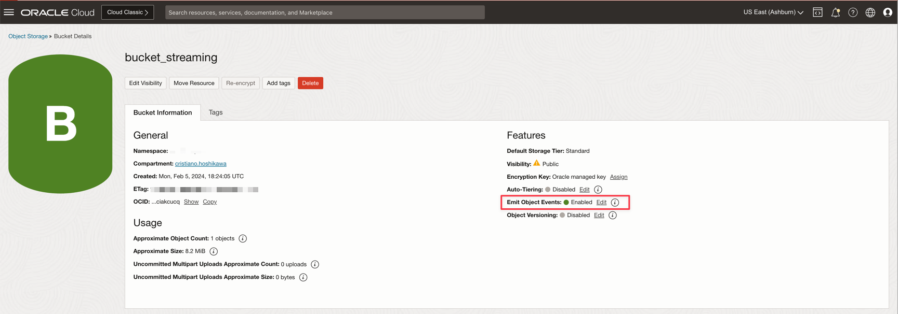

## Task 4 - Create your OCI Function

To execute the following steps, download code from here [OCI_Streaming_Claim_Check.zip](./files/OCI_Streaming_Claim_Check.zip).

### Understand the Code

There are 2 codes here, the main code (HelloFunction.java) and the **OCI Streaming** producer code (Producer.java).

**HelloFunction.java**
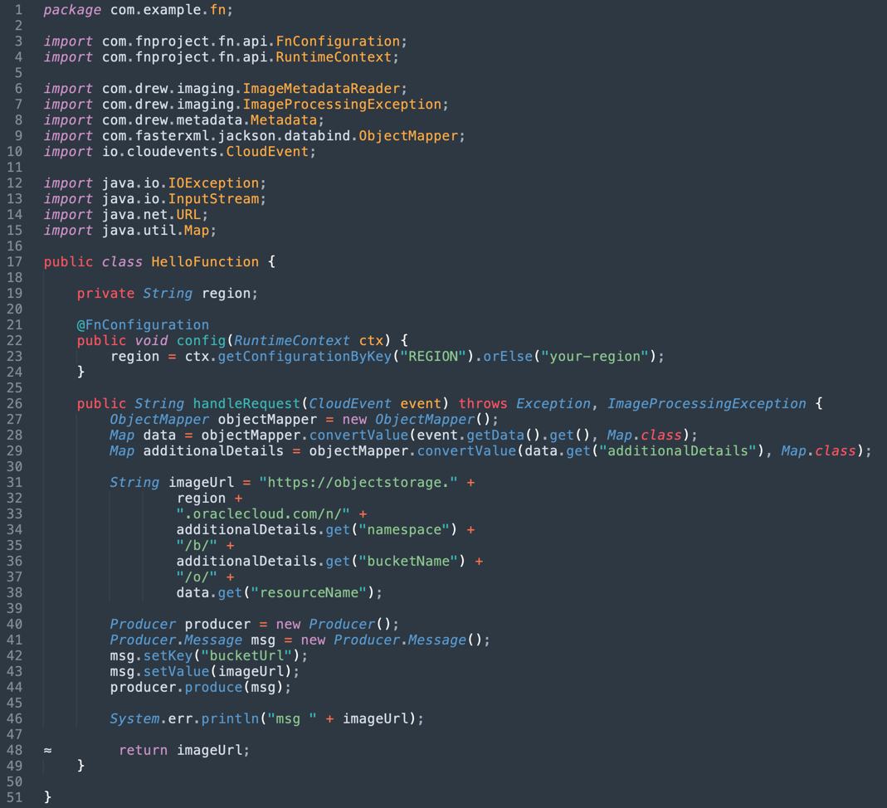

In this part of code, we need to capture the data coming from the **OCI Events**, so there are 3 sources:

- **Context**: This property came from RuntimeContext and we catch the **REGION** variable.
- **Event Data**: **OCI Events** produces data as **resourceName**.
- **Additional Event Details Data**: **OCI Events** for Object Storage produces data as **namespace** and **bucketName**.

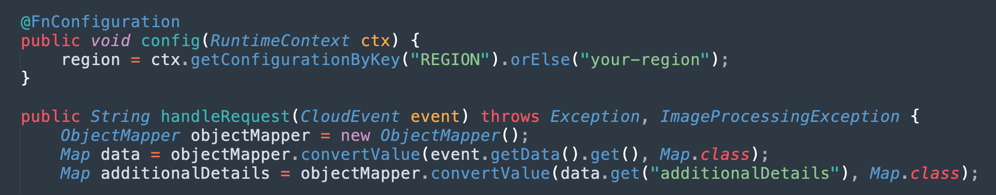

So we can mount the **Object Storage File URL** 

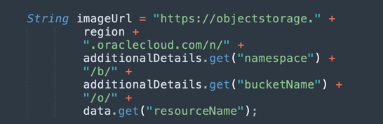

And the main code can pass the **URL** to the **OCI Streaming** producer:

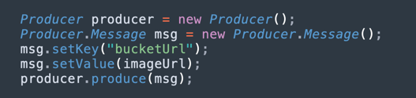

**Producer.java**
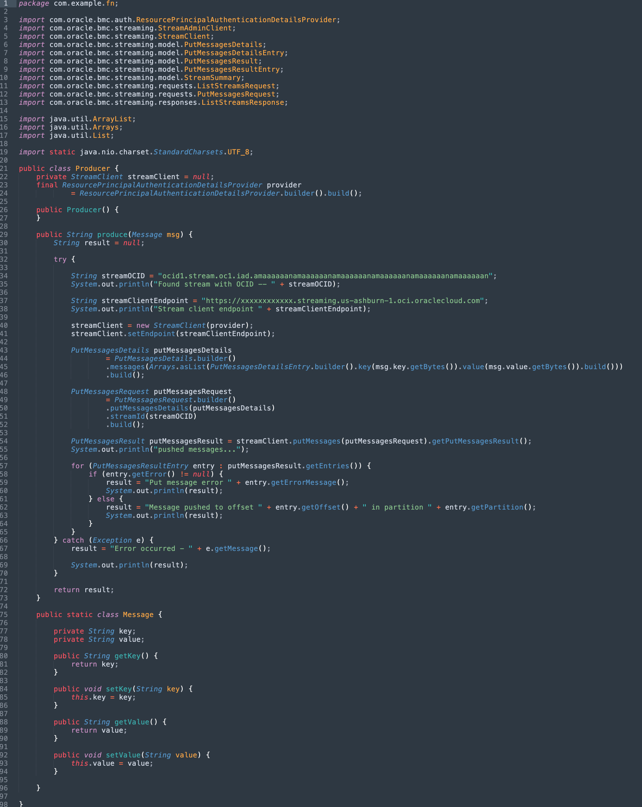

This is the Message Class structure to produce the Kafka information for the **Claim-check** pattern. Just only **key** and **value**.

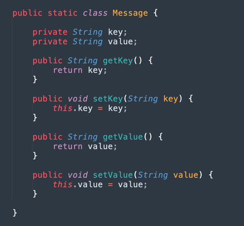

And this is the basic code to produce to the streaming.

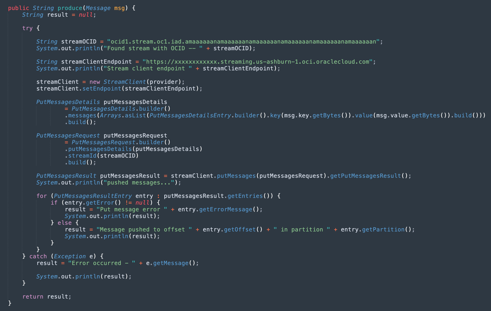

### Build and deploy the OCI Function

In this step, we will need to use the OCI CLI to create the OCI functions and deploy code into your tenancy. 
To create an OCI function, see [Functions: Get Started using the CLI](https://docs.oracle.com/en-us/iaas/developer-tutorials/tutorials/functions/func-setup-cli/01-summary.htm), follow the steps and search for Java option. 
You will need to create your function with this information:

    Application: ocistreaming-app
    Context Variable: REGION=<your streaming region name, ex: us-ashburn-1>

Remember the compartment you deployed your function. You will need this information to configure your OCI Events.

## Task 5 - Configure the OCI Events

Let's configure an **Event Rule** to trigger your function to obtain the bucket information and send it to the **OCI Streaming**.
First, find

Select the same compartment for your **Rule** and click on **Create Rule** button
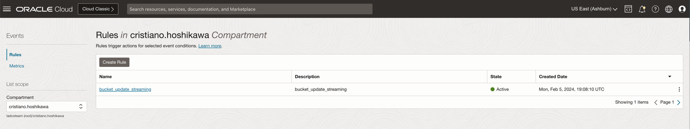

And fill the Condition as **Event Type**, Service Name as **Object Storage** and **Event Type** with Object-Create, Object-Delete and Object-Update values.
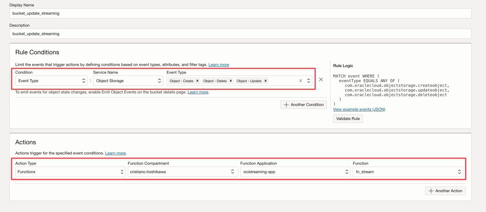

## Task 6 - Test your Circuit of Events
   bucket -> events -> function -> streaming
   Note: For private networks, the test code needs a bastion connected to the same private-subnet of your OCI Streaming